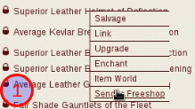

# 说明Readme

根据HV - Item Menu 1.0改编而来.中键菜单

How to use 使用方法:

In the equipment page 在各个页面的装备上

1. Press mouse middle button 按下鼠标中键
2. Move to option (do not release middle button)移动到指定选项(不要松开)
3. Release middle button 释放鼠标中键(即中键弹起)

各个文件功能(只选其中一个就好了)
Each file function(They may conflict with each other)

* 186248.user.js Original edition 原版,包含分解,附魔,link等功能
* 186248_freeshop.user.js  Original edition + Send to freeshop 原版+发送到免费商店(捐助装备)功能
* 186248_Salvage_all.user.js Original edition + 原版+分解所有装备功能
* lost :玩家指定的选中物品发送给某人(跳转到mm页面)

发送到免费商店

How to Use to send to freeshop.

